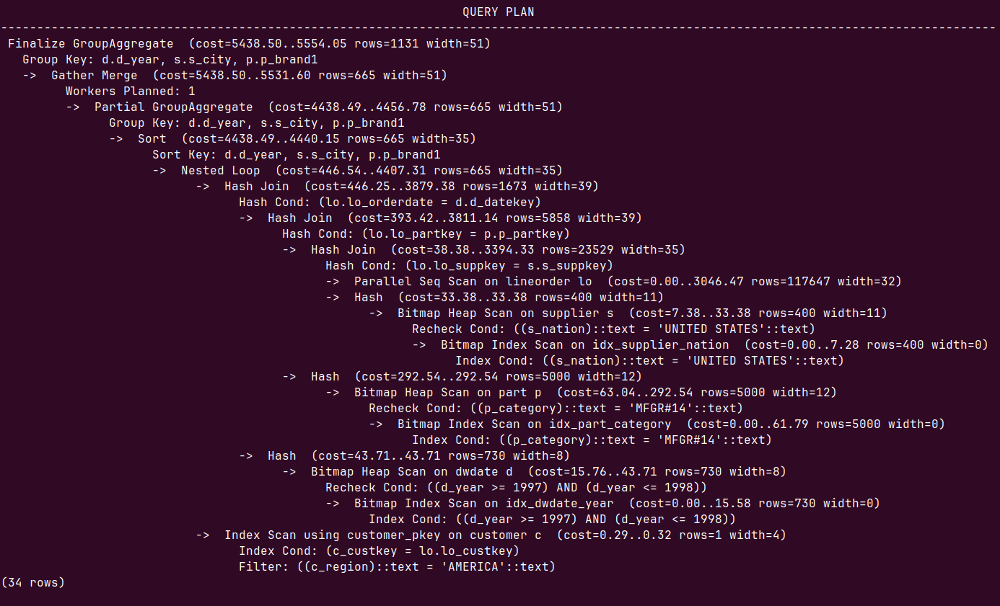
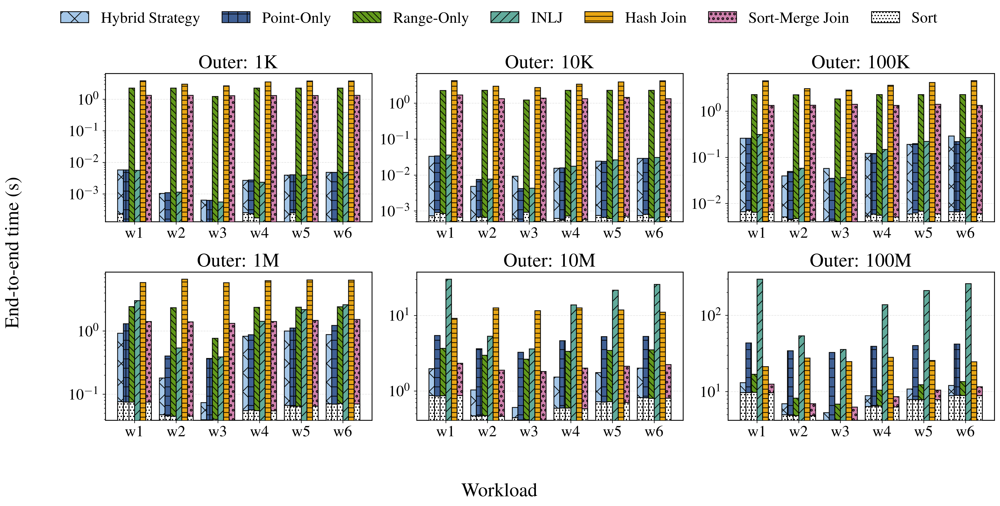
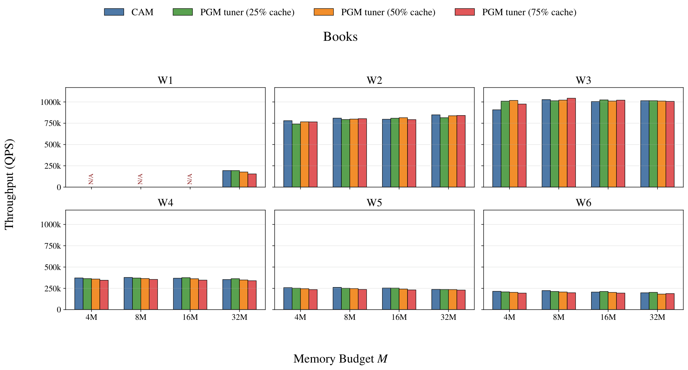
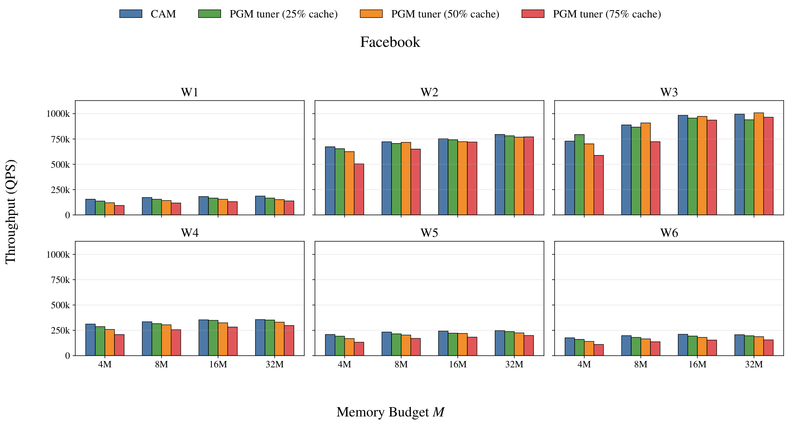
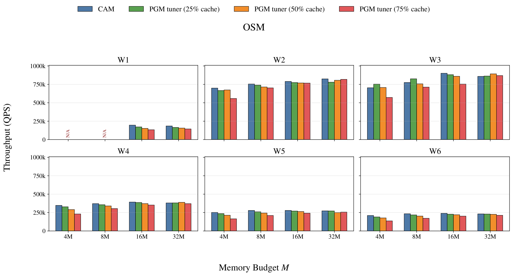
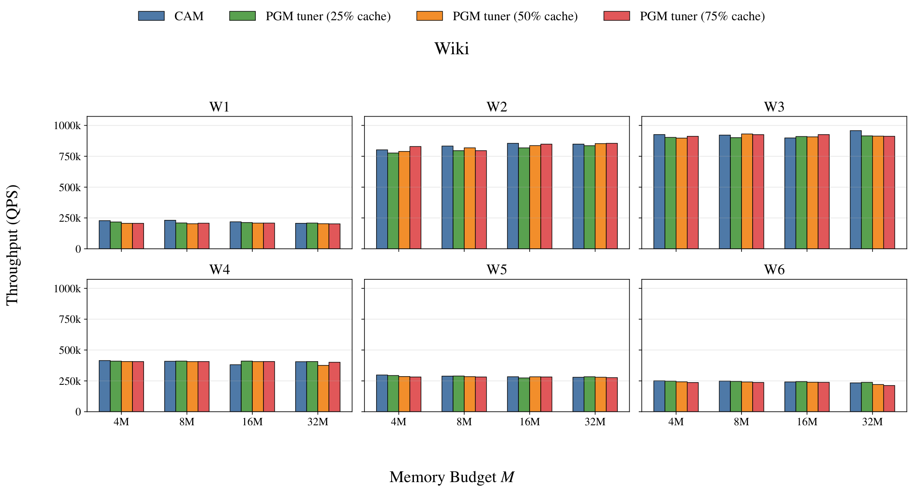
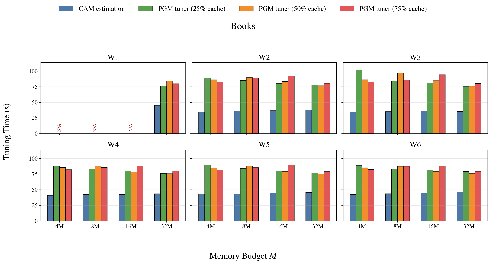
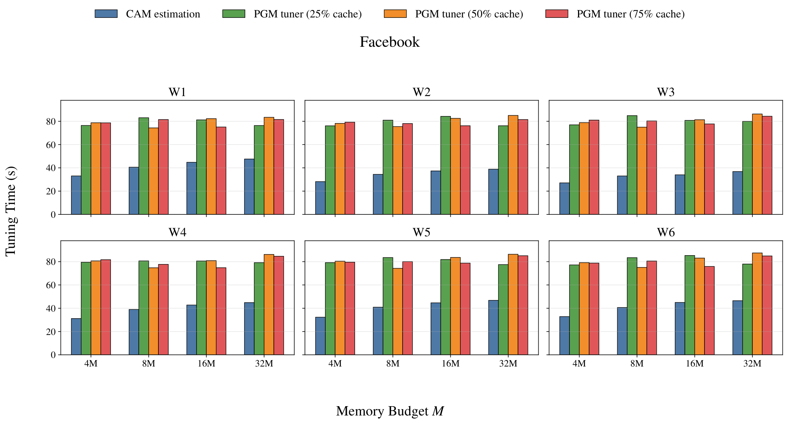
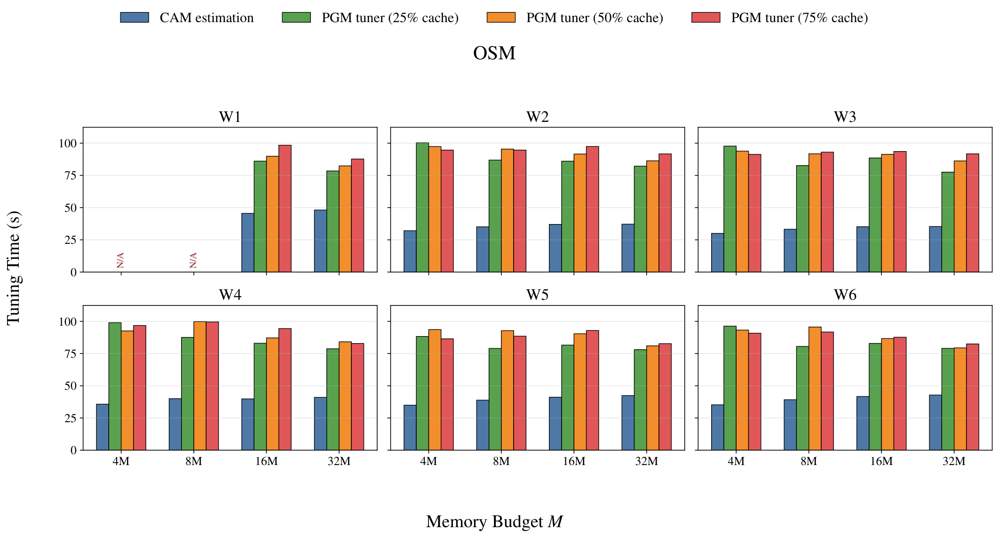
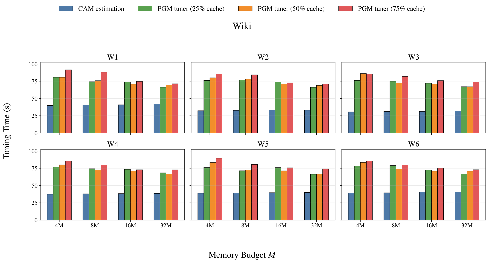

# Real Join Example and CAM Application
Consider an SSB Q4.3:
```sql
SELECT
    d.d_year,
    s.s_city,
    p.p_brand1,
    SUM(lo.lo_revenue - lo.lo_supplycost) AS profit
FROM part AS p
JOIN lineorder AS lo
    ON lo.lo_partkey = p.p_partkey
JOIN supplier AS s
    ON lo.lo_suppkey = s.s_suppkey
JOIN customer AS c
    ON lo.lo_custkey = c.c_custkey
JOIN dwdate AS d
    ON lo.lo_orderdate = d.d_datekey
WHERE
    p.p_category = 'MFGR#14'
    AND s.s_nation = 'UNITED STATES'
    AND c.c_region = 'AMERICA'
    AND d.d_year BETWEEN 1997 AND 1998
GROUP BY
    d.d_year, s.s_city, p.p_brand1
ORDER BY
    d.d_year, s.s_city, p.p_brand1;

```

The plan generated by Postgresql for the above query is:



This plan illustrates a natural integration point for CAM. The outer input of the indexed nested-loop join is not necessarily a base relation; here it is the intermediate result produced by the preceding hash-join subtree (estimated at 1,673 tuples). For the original unordered probe stream, CAM's point-query model can estimate the learned-index I/O cost directly. Alternatively, the optimizer can introduce a `Sort(lo_custkey)` node on this intermediate result and consider a CAM-guided hybrid join path: the sorted probes are partitioned by local density and each segment uses either point or range probing according to CAM's estimated cost. The additional sort cost, as well as the costs of hash joins, aggregation, and the final ordering, remain handled by the DBMS's existing cost model. Thus, CAM acts as a composable cost component for learned-index access paths rather than replacing the whole-query optimizer.


# Relaxing the Uniform Error and Page-Offset Assumptions

The uniform prediction-error and in-page-offset assumptions used in the current derivation are not fundamental to CAM. We next give distribution-independent formulations for the data-access cost (DAC) and show that the original closed forms are special cases with a bounded approximation error. Let $C=C_{\mathrm{ipp}}$ denote the number of items per page, $r$ the true rank of a queried key, $\hat y$ its predicted rank, and $e=\hat y-r$ the prediction error, where $|e|\le \epsilon$.

### All-at-once fetching

Let $L = (\hat y - \epsilon) \bmod C$ be the in-page offset of the left boundary. Then the DAC for all-at-once fetching is given by:
$$
DAC=1+\lfloor \frac{L+2\epsilon}{C}\rfloor 
$$

Define
$$ 
2\epsilon = qC + a,\quad q = \left\lfloor \frac{2\epsilon}{C} \right\rfloor,\quad 0 \le a < C,
$$
Then we have
$$
E(DAC) = 1 + q + \mathbf{1}\{L \ge C-a\}\\
$$


If $L$ is uniformly distributed over $\{0,\dots,C-1\}$, then

$$
\mathbf{1}\{L \ge C-a\} = \frac{a}{C}
$$

and we recover the standard form

$$
E(DAC) = 1 + q + \frac{a}{C} = 1 + \frac{2\epsilon}{C}
$$


### One-by-one fetching

Let $L = (\hat y - \epsilon) \bmod C$ be the in-page offset of the left boundary. And define $T=L \bmod C$ as the in-page offset of the lower bound. The distance from L to the true position r is $X=r-L$.


Substituting $L=\hat y-\epsilon$ and $e=\hat y-r$, we have
$$
X=r-(\hat y-\epsilon)=\epsilon - e 
$$

Therefore, after fetching the page containing L, the number of additional pages that must be traversed before reaching the page containing the true position is
$$
\lfloor \frac{T+X}{C} \rfloor.
$$

Hence, for an individual query, the exact logical data-access cost is
	​
$$
DAC = 1 + \left\lfloor \frac{T+\epsilon-e}{C} \right\rfloor
$$

Importantly, this equality makes no assumption about either the prediction-error distribution or the page-offset distribution.

#### Case 1: arbitrary error distribution, uniformly mixed page offsets

We first relax the uniform-error assumption while retaining only a page-alignment assumption. Suppose that, conditional on X=x, the lower-bound offset is uniformly distributed over a page:
$$
T|X=x \, \sim U[0,C]
$$
For any fixed integer $x\ge 0$, 
$$
\frac{1}{C}\sum_{t=0}^{C-1}\lfloor \frac{t+x}{C} \rfloor = \frac{x}{C}
$$
It follows that
$$
E[DAC|X=x] = 1+\frac{x}{C}
$$
Taking expectation over an **arbitrary distribution of X** gives
$$
E[DAC]=1+\frac{E[X]}{C}=1+\frac{\epsilon-E(e)}{C}
$$
In particular, **the complete prediction-error distribution is irrelevant to expected DAC; only its mean is required**, provided that page alignment is uniformly mixed. The current result
$$
E[DAC]=1+\frac{\epsilon}{C}
$$
is  therefore simply the zero-mean special case $E[e]=0$. Uniformly distributed errors imply $E[e]=0$, but uniformity itself is unnecessary. A concentrated, multimodal, or otherwise non-uniform error distribution gives exactly the same DAC whenever its mean is zero.

#### Case 2: removing the uniform page-offset assumption as well

We can go one step further and make **no distributional assumption on either T or e**.

Starting from
$$
DAC = 1 + \left\lfloor \frac{T+\epsilon-e}{C} \right\rfloor
$$
use the elementary inequality we get
$$
\frac{T+\epsilon-e}{C}<DAC \le 1+\frac{T+\epsilon-e}{C}
$$
Taking expectations,
$$
\frac{E[T]+\epsilon-E[e]}{C}<E[DAC] \le 1+\frac{E[T]+\epsilon-E[e]}{C}
$$
So even after removing **both** uniform assumptions, we obtain a distribution-free approximation whose error is strictly less than one page.

The important point is that this estimator requires only two first-order statistics, $E[e]$ and $E[T]$, rather than the full prediction-error distribution.


# Expanded Join strategy Comparison 
We further compare our hybrid strategy with conventional Hash Join and Sort-Merge Join while varying the outer-relation size from 1K to 100M, with the inner relation size fixed on 200M records. The reported end-to-end time includes the sorting overhead for strategies that require sorted probe keys, which is shown separately as the dotted component.



The results reveal a clear cardinality-dependent trade-off. For small outer relations (1K–100K), index-based strategies substantially outperform Hash Join and Sort-Merge Join because they access only the relevant portions of the indexed inner relation, whereas the conventional joins incur an almost fixed cost for processing the large inner relation. As the outer relation grows, this advantage gradually decreases: the cost of repeated index probes increases with the number of outer tuples, while the full-scan cost of Hash Join and Sort-Merge Join is increasingly amortized. At 10M outer tuples, Hybrid remains substantially faster than Hash Join and is generally competitive with or faster than Sort-Merge Join. At 100M tuples, Sort-Merge Join becomes competitive and can slightly outperform Hybrid for some workloads, as expected when a large fraction of the inner relation needs to be accessed.

Across the tested cardinalities and workload mixtures, Hybrid nevertheless provides the most robust performance among the index-based strategies. It avoids the over-fetching of Range-Only in sparse regions and the large number of independent probes incurred by Point-Only and unsorted INLJ for large outer relations. These results suggest that Hybrid is complementary to, rather than a replacement for, conventional joins: a practical query optimizer can expose Hybrid as an additional physical join operator and select among Hybrid, INLJ, Hash Join, and Sort-Merge Join according to the estimated workload density and relation cardinalities.


# PGM Index Tuning: Query Throughput and Tuning Time Comparison

Several results are reported as N/A because the corresponding indexes, once constructed, would exceed the available memory capacity even with the max candidate epsilon 256. Consequently, index construction could not be completed for these configurations.

## Query Throughput (QPS) Comparison









## Tuning Time Comparison









